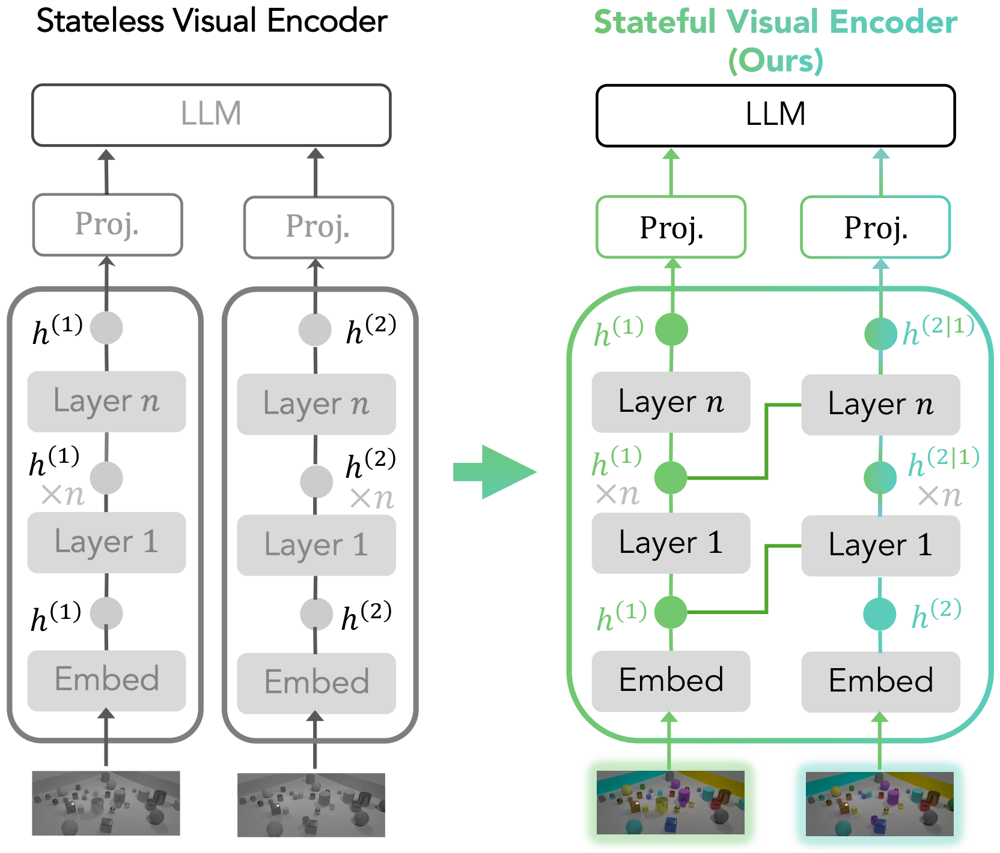

<h1 align="center">Stateful Visual Encoder (SVE)</h1>

<p align="center">
  
</p>

<p align="center">
  Official code for <b><a href="https://statefulvisualencoders.github.io/">"Stateful Visual Encoders for Vision-Language Models"</a></b>
</p>
<p align="center">
  <a href="https://zwcolin.github.io/">Zirui Wang</a>,
  <a href="https://yujunwei04.github.io/">Junwei Yu</a>,
  <a href="https://www.adamyala.org/">Adam Yala</a>,
  <a href="https://dchan.cc/">David M. Chan</a>,
  <a href="https://people.eecs.berkeley.edu/~jegonzal/">Joseph E. Gonzalez</a>,
  <a href="https://people.eecs.berkeley.edu/~trevor/">Trevor Darrell</a>
</p>
<p align="center"><sub><a href="https://www.voio.com/">Voio, Inc.</a> &nbsp;·&nbsp; <a href="https://www.berkeley.edu/">UC Berkeley</a> &nbsp;·&nbsp; <a href="https://www.ucsf.edu/">UCSF</a></sub></p>

<p align="center">
  <a href="https://statefulvisualencoders.github.io/"></a>
  <!-- TODO: point the paper badge to the arXiv URL once available -->
  <a href="https://arxiv.org/pdf/2606.04433"></a>
  
  
</p>

<p align="center">
  <a href="#what-it-is">What it is</a> &middot;
  <a href="#using-the-sve">Using the SVE</a> &middot;
  <a href="#how-it-works">How it works</a> &middot;
  <a href="#data-preparation">Data</a> &middot;
  <a href="#citation">Citation</a>
</p>

---

```bash
git clone https://github.com/StatefulVisualEncoders/StatefulVisualEncoders.git && cd StatefulVisualEncoders
pip install -e .                              # the `sve` package (Python ≥ 3.10, PyTorch ≥ 2.4, Transformers ≥ 5.0)
pip install flash-attn --no-build-isolation   # optional: enables the batched varlen path
```

The one core operation — **inject** the Stateful Visual Encoder into a pretrained VLM, then finetune:

```python
from transformers import AutoModelForImageTextToText
from sve import inject_sve

model = AutoModelForImageTextToText.from_pretrained("Qwen/Qwen3.5-VL-4B", trust_remote_code=True)
inject_sve(model)          # auto-detects the family, applies the Cross+FFN recipe in place
# ... then finetune end-to-end with the vision tower trainable.
```

> **Verify on any backbone** — `python -m sve.demo --model_path Qwen/Qwen3.5-VL-4B` loads the model,
> runs a 2-image forward, and checks the SVE is an **exact no-op at init** and that the path is live.

This repo is intentionally minimal: the **method** (`sve/`) and **dataset preparation** (`data_prep/`),
nothing else.

## What it is

In a standard open-weight VLM the visual encoder is *stateless*: each image is encoded independently,
so small but task-critical changes between images can be attenuated before the language model ever
compares them. The **Stateful Visual Encoder (SVE)** adds causal cross-image interaction *inside* the
vision encoder — the current image's features attend to the previous image's features before the tokens
reach the LM — using the winning **Cross+FFN** design.

It is a small, drop-in addition: a cross-attention + FFN block before each ViT block, with weights
cloned from the host block and output projections zero-initialized, so an untrained SVE is an **exact
no-op** and finetuning starts from the pretrained model's behavior.

## Using the SVE

`inject_sve` dispatches on `model.config.model_type`. All five families are supported;
the SVE block mirrors each family's own vision block (FFN kind, norm kind, RoPE-or-not) so its cloned
weights are well-typed.

| Family | `model_type` | Vision block |
|--------|-------------|--------------|
| Qwen3.5 | `qwen3_5` | fused-QKV, LayerNorm, GELU-MLP, vision-RoPE |
| Qwen3-VL | `qwen3_vl` | same as Qwen3.5 (+ deepstack tap) |
| GLM-4.6V-Flash | `glm4v` | fused-QKV, RMSNorm, SwiGLU, vision-RoPE |
| InternVL 3.5 | `internvl` | separate-QKV, LayerScale, no RoPE |
| Gemma-3 | `gemma3` | SigLIP, separate-QKV, no RoPE |

### `inject_sve(model, proj_init_std=0.0)`

The recipe is fixed (it's the final design, not a search space): a cross-attention + FFN block
before **every** ViT block, with attention heads matching the host vision encoder's head count. The one
task-dependent choice is the output-projection init:

| Arg | Meaning |
|-----|---------|
| `proj_init_std` | `0.0` (default) → zero-init, exact no-op at start (**synthetic-task recipe**). `1e-4` → tiny-normal (**real-world recipe**). |

The remaining recipe constants (clone Q/K/V + first FFN linear from the host block, zero-init output
projections, stop-gradient on the predecessor keys/values, Z1 self-fallback for each sequence's first
image, positional embeddings preserved) are fixed inside the package — the final recipe, not knobs.

### Wiring the cross-image signal during training

The SVE needs to know, per forward, how images group into sequences (so image *i* attends to image
*i-1*). Pass a per-sample image count via the keyword `image_seqlens_per_sample` to `model(...)`:

```python
# one sample with two images (before -> after):
out = model(input_ids=..., pixel_values=..., image_grid_thw=...,
            labels=..., image_seqlens_per_sample=[2])
out.loss.backward()
```

`inject_sve` installs a forward-pre-hook that consumes this keyword and routes the grouping into the
vision encoder (FSDP-safe). Your data collator should emit one integer per sample = the number of images
in that sample, in sequence order (oldest image first). That's the only training-loop change required;
everything else is ordinary VLM SFT with the vision tower unfrozen.

### Training recipe

Full finetuning (vision tower + connector + LM all trainable), bf16, global batch 384, cosine schedule
with 10% warmup. Per-task settings:

| Task | Steps / Epochs | LR | `mask_history` | `proj_init_std` |
|------|----------------|-----|----------------|------------------|
| Spatial Aggregation (dot distance/area) | 500 steps | 1.5e-5 | true | 0.0 |
| Visual Differencing (CLEVR-Multi-Change) | 250 steps | 1.5e-5 | true | 0.0 |
| Trajectory Cloning (VisGym) | 250 steps | 1.5e-5 | **false** | 0.0 |
| Longitudinal Radiology (Medical-Diff-VQA) | 2 epochs | 1.5e-5 | true | **1e-4** |
| Image Comparison (ImgEdit) | 2 epochs | 1.5e-5 | true | **1e-4** |
| Remote Sensing (LEVIR-CC) | 2 epochs | **2e-5** | true | **1e-4** |

> **Gradient accumulation.** Multimodal SFT with token-weighted loss (`num_items_in_batch`)
> double-counts the `1/grad_accum` normalization (once in the loss, once in `backward()`), so the
> gradient magnitude drifts with how you split the global batch. Cancel it by multiplying the loss by
> the current `gradient_accumulation_steps`, and ensure the model forwards `num_items_in_batch` to its
> loss function. Calibrate `max_grad_norm` for the corrected magnitude.

## How it works

For each ViT block, the patched forward runs, *before* its self-attention:

```
x = x + proj( CrossAttn( Q = norm1_q(x),  K,V = stop_grad(norm1_kv(prev)) ) )
x = x + FFN( norm2(x) )
# then the host block's usual self-attention + FFN
```

At init `proj` and the FFN's second linear are zero, so the two added lines are exact no-ops. `Q/K/V`
and the first FFN linear are cloned from the host block, giving the SVE block a layer-matched feature
basis. A sequence's first image has no predecessor and attends to itself (Z1 fallback). For
Qwen3.5/3-VL/GLM-4.6V the cross-attention is batched with `flash_attn_varlen_func`; for InternVL/Gemma-3
(dense, no RoPE) it loops over images.

Files: `sve/cross_ffn.py` (the module), `sve/inject.py` (dispatch), `sve/families/` (one adapter per
backbone), `sve/utils.py` (shared plumbing).

## Data preparation

Six task families, all formatted as **ShareGPT JSONL** (`{"messages": [...], "images": [...]}`).
Per-dataset sources, licenses, and the exact conversation formats are in [`docs/DATA.md`](docs/DATA.md).

| Task | Where to get it |
|------|-----------------|
| Multi-object Visual Differencing (CLEVR-Multi-Change) | [`zwcolin/clevr-multichange`](https://huggingface.co/datasets/zwcolin/clevr-multichange) — images + captions |
| Cross-image Spatial Aggregation (Dot Distance/Area) | [`zwcolin/dot-distance-area`](https://huggingface.co/datasets/zwcolin/dot-distance-area) — images + captions |
| Visual Trajectory Behavioral Cloning (VisGym) | reproduce from upstream: `python -m data_prep.build_visgym` |
| Fine-grained Image Comparison (ImgEdit) | captions on `zwcolin/sve-data`; images: `python -m data_prep.download_imgedit` |
| Remote Sensing (LEVIR-CC) | captions on `zwcolin/sve-data`; images: [`lcybuaa/LEVIR-CC`](https://huggingface.co/datasets/lcybuaa/LEVIR-CC) |
| Longitudinal Radiology (Medical-Diff-VQA) | MIMIC-CXR (PhysioNet credentialed; not redistributable) |

```bash
# the two self-contained datasets (images + captions); download, then unzip the shards:
python -c "from huggingface_hub import snapshot_download; snapshot_download('zwcolin/clevr-multichange', repo_type='dataset', local_dir='data/clevr')"
( cd data/clevr && for f in images_part_*.zip; do unzip -q "$f"; done )
python -c "from huggingface_hub import snapshot_download; snapshot_download('zwcolin/dot-distance-area', repo_type='dataset', local_dir='data/dot_area')"
( cd data/dot_area && for f in images_part_*.zip; do unzip -q "$f"; done )

# caption JSONLs (ImgEdit, LEVIR-CC) + the from-upstream reproducers:
python -m data_prep.download --out data
python -m data_prep.download_imgedit --out data    # the exact ImgEdit subset from sysuyy/ImgEdit
python -m data_prep.build_visgym --split train --limit 100000 --images_root data --out data/visgym_train.jsonl
```

To build any single-shot task's captions from your own `{images, target}` records, use
`data_prep.build_generic` (templates live in `data_prep/formats.py`).

## Acknowledgments

We thank Kate Saenko, Mayank Mishra, Sanjay Sriram Subramanian, Kumar Krishna Agrawal, Lisa Dunlap,
Natalia Harguindeguy, Baifeng Shi, XuDong Wang, and Fangzhou Zhao for discussion and support. The
authors, through UC Berkeley, were supported by gifts from Accenture, AMD, Anyscale, Broadcom, Cisco,
Google, IBM, Intel, Intesa Sanpaolo, Lambda, Lightspeed, Mibura, Microsoft, NVIDIA, Qualcomm,
Samsung SDS, and SAP.

This README's layout is adapted from [PixelRAG](https://github.com/StarTrail-org/PixelRAG) — thanks to
[Yichuan Wang](https://yichuan-w.github.io/).

## Citation

```bibtex
@article{wang2026sve,
  title  = {Stateful Visual Encoders for Vision-Language Models},
  author = {Wang, Zirui and Yu, Junwei and Yala, Adam and Chan, David M. and Gonzalez, Joseph E. and Darrell, Trevor},
  year   = {2026}
}
```

## License

MIT
